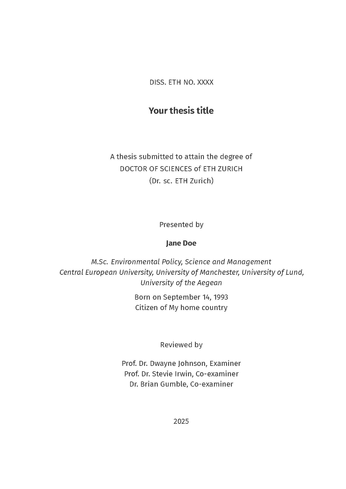
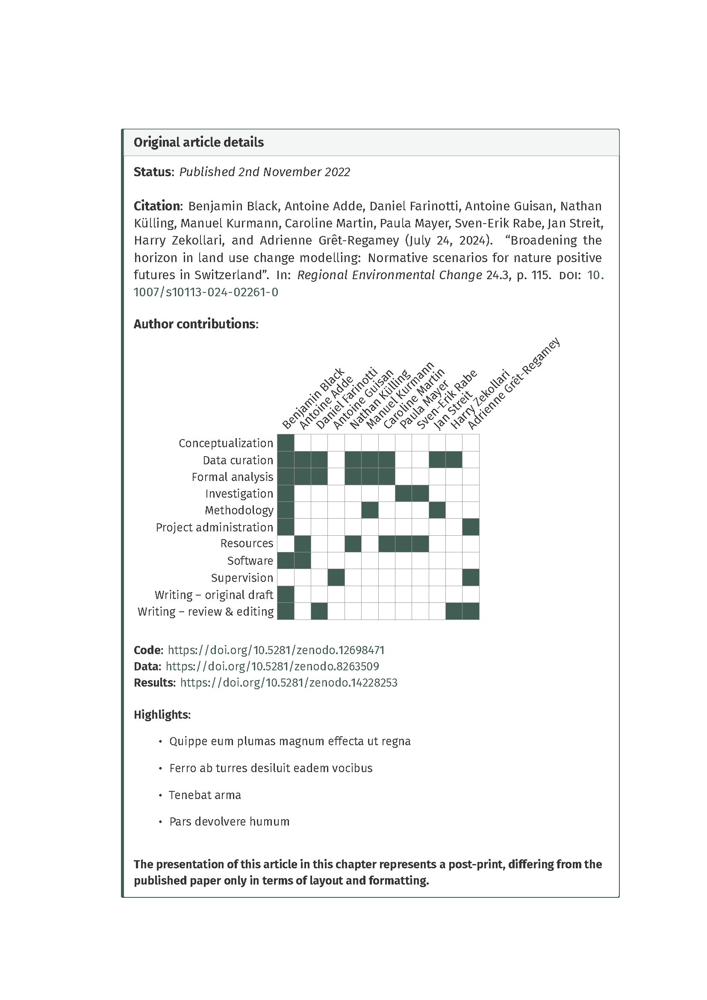

# Quarto PhD thesis template for ETH Zurich

This is a template that is intended to meet the [requirements](https://ethz.ch/students/en/doctorate/doctoral-thesis-examination.html) for cumulative paper PhD thesis at ETH Zurich. However, it is worth noting that there may be discrepancies between departments and as such you should check the requirements for your department (My thesis was under D-BAUG).

I built this template based upon the `quarto-phd-thesis` template from `james-d-h`: <https://github.com/james-d-h/quarto-phd-thesis>, adding some notable features.

The template is geared towards producing PDF output as I would imagine this is the most common format that theses must be submitted in.

Here is the example produced by the template for you to view: [Example PDF](_book/quarto-eth-phd-thesis.pdf)

I have also produced this README as a [webpage](https://blenback.github.io/quarto-eth-phd-thesis.html) for easier reading.

## 📄 Features

-   The ability to add a cover page using the [`quarto_titlepages`](https://nmfs-opensci.github.io/quarto_titlepages/) extension

-   Custom functions to ensure consistent formatting of all figures and tables according to user specified color palettes.

-   Use of `.Rprofile` to manage package loading across chapters

-   The ETH title page and a translated version of the summary into one of the Swiss national languages.

-   Custom Quarto call-out boxes to display the details of published articles at the start of chapters including a visualization of author [CRediT](https://www.elsevier.com/researcher/author/policies-and-guidelines/credit-author-statement) contributions.

-   Additional LaTeX formatting

## 🚀 Getting Started

### 1. Prerequisites

Ensure the following are installed:

-   [Quarto](https://quarto.org/)
-   [R](https://www.r-project.org/) and [RStudio](https://posit.co/download/rstudio/)
-   A LaTeX distribution (e.g., TinyTeX or TeX Live)

### 2. Install the template

Directly using Quarto from the the terminal:

``` bash
quarto use template blenback/quarto-eth-phd-thesis
```

It will ask for an empty directory name where to put the files, give it a new directory name.

Once you do that you can render from within the directory.

Or by cloning the repository

``` bash
git clone https://github.com/YOUR_USERNAME/quarto-eth-phd-thesis.git
cd quarto-eth-phd-thesis
```

### 3. Open in RStudio

Open the `quarto-eth-phd-thesis.Rproj` file in RStudio to access the full project environment.

### 4. Render the Thesis

From the RStudio console or terminal:

``` bash
quarto render
```

## 🗂️ Project Structure

``` bash
quarto-eth-phd-thesis/
  ├── bibliography.bib # BibTeX file for references
  ├── _book/ # Output directory for rendered book
  ├── chapters/ # Main content chapters^
  |    ├── introduction
  |    |   ├── introduction.qmd # Introduction chapter
  |    ├── paper-01
  |    |   ├── paper-01.qmd # First paper chapter
  |    |   ├── paper-01-appendix.qmd # Appendix for the first paper
  |    |   ├── paper-01-figs.R # Script to prepare figures
  |    |   ├── figures/ # Figures for the first paper
  |    |   ├── data/ # Data for the first paper
  |    ├── sota
  |    |   ├── sota.qmd # State of the art chapter
  |    ├── structure
  |    |   ├── structure.qmd # Structure chapter
  |    ├── synthesis 
  |    |   ├── synthesis.qmd # Synthesis chapter
  ├── endmatter/ # Appendices, references, curriculum Vitae
  |    ├── appendices.qmd # Appendices
  |    ├── references.qmd # References
  |    ├── CV.qmd # Curriculum vitae
  |    ├── CV.pdf # Curriculum vitae file
  ├── _extensions/ # Custom Quarto extensions
  ├── fonts/ # Custom fonts (e.g., FiraSans-Light.ttf)
  ├── frontmatter/ # Cover page, , , template-partials
  |    ├── acknowledgements.qmd # Acknowledgments
  |    ├── images/
  |    |   ├── cover_background.png # Background image for cover page
  |    ├── summary_translation.qmd # summary
  |    ├── summary_translation.qmd # Translation of summary
  ├── index.qmd # Main Quarto document
  ├── LaTeX_pkgs/ # Additional LaTeX packages not available through Tinytex
  ├── LICENSE # License file
  ├── ETH-thesis-template.cls # ETH Zurich thesis LaTeX class
  ├── partials/
  |    ├── title.tex
  |    ├── before-body.tex
  |    ├── toc.tex
  |    ├── _coverpage.tex
  |    ├── _author-affiliation-themes.tex
  |    ├── titlepage-theme.lua
  |    ├── coverpage-theme.lua
  |    ├── _header-footer-date-themes.tex
  |    ├── _title-themes.tex
  |    ├── _titlepage.tex
  |    ├── pandoc.tex
  |    ├── header.tex
  ├── quarto-eth-phd-thesis.Rproj # RStudio project file
  ├── quarto-eth-phd-thesis.tex # Compiled LaTeX version (optional)
  ├── _quarto.yml # Main Quarto project config
  ├── README.md # This file
  ├── .gitignore # Git ignore file
  ├── .Rprofile # R profile for package loading
```

## 🛠️ Customization

### Package loading

I use the `.Rprofile` to load R packages rather than specifying packages within individual `.qmd` files or `.R` scripts as the .Rprofile is called prior to rendering each file. Add any additional packages you require here.

```{r}
#load packages
packs<-c("ggplot2", "knitr", "kableExtra", "ggthemes", "stringr")

# Load required packages
invisible(lapply(packs, require, character.only = TRUE))
```

### Unified table and figure theming

Also in the `.Rprofile` are some functions to streamline uniform styling of figures and tables throughout your document

For tables the `thesis_tbl()` function sets options for `knitr::kbl()` and `kableExtra::kable_styling()` to produce booktabs style tables, with center aligned content and bold column titles:

```{r}
thesis_tbl <- function(x, escape, ltable = FALSE) {
  x %>%
    kbl(digits = 3,
        align = "c",
        booktabs = T,
        format = "latex",
        longtable = ltable,
        escape = escape) %>%
    kable_styling(full_width = FALSE,
                  font_size = 10,
                  # latex_options = c("hold_position")
                  )%>%
    column_spec(1:ncol(x),
                latex_valign = "t") %>%
    row_spec(0, bold=TRUE) %>%
    asis_output()
}
```

An example of applying this function is included in `chapters/paper-01-qmd`:

```{r}
#| label: tbl-alloc_param_summary
#| tbl-cap: Dummy table
#| tbl-pos: H

#load csv of allocation parameter summary statistics
Calibration_summary <- read.csv("chapters/paper-01/data/Validation_summary.csv")

#replace . in column names with white space
colnames(Calibration_summary) <- str_replace_all(colnames(Calibration_summary), "\\.", " ")

#output as markdown table with Knitr::kable
#knitr::kable(Calibration_summary, align=rep('c', ncol(LULC_agg_summary)), format = "markdown")
Calibration_summary %>% 
  thesis_tbl(escape = FALSE)
```

For figures the function `theme_publication()` sets a custom `ggplot2` theme:

```{r}
#' theme_publication
#' 
#' custom ggplot2 theme to apply to all plots
#' 
#' @param base_size numeric base font size
#' @param base_family character base font family
#' @return ggplot2 theme
#' @export

theme_thesis <- function(
    base_size=14,
    base_family="Fira Sans"
) {
  (theme_foundation(
    base_size=base_size,
    base_family=base_family)+
     theme(
       plot.title = element_text(face = "bold",size = rel(1.2),hjust = 0.5),
       text = element_text(),
       panel.background = element_rect(colour = NA),
       plot.background = element_rect(colour = NA),
       panel.border = element_rect(colour = NA),
       axis.title = element_text(face = "bold",size = rel(0.8)),
       axis.title.y = element_text(angle=90,vjust =2),
       axis.title.x = element_text(vjust = -0.2),
       axis.text = element_text(), 
       axis.line = element_line(colour="black"),
       axis.ticks = element_line(),
       panel.grid.major = element_blank(),
       panel.grid.minor = element_blank(),
       legend.key = element_rect(colour = NA),
       legend.position = "bottom",
       legend.direction = "horizontal",
       legend.key.size= unit(0.2, "cm"),
       legend.title = element_text(face = "bold",
                                   hjust=0.5),
       plot.margin=unit(c(10,5,5,5),"mm"),
       strip.background=element_rect(colour="#f0f0f0",fill="#f0f0f0"),
       strip.text = element_text(face="bold")
     )
  )
}
```

In addition the `.Rprofile` contains a series of functions for producing custom continuous and discrete color palettes with the base set of colors specified within the function `thesis_color()`:

```{r}
thesis_color <- function(...) {
  
  thesis_colors <- c(
  'Seafoam' = "#86B4A4", 
  'Beigetan' =	"#AC9E7C",
  'Lightgreen' =	"#8D9973",
  'Olivegreen' =	"#4F5838",
  'Forestgreen' =	"#2D4631",
  'Emeraldgreen' =	"#20342B",
  'Bluegreen' =	"#1C2D27",
  'Brown' =	"#413328",
  'Redbrown' =	"#4E3028",
  'Rust' =	"#8A341F",
  'Terracotta' =	"#A96524",
  'Orange' =	"#C06F2E",
  'Beige' =	"#D0A26E",
  'Paleorange' =	"#D69D68",
  'Bone' =	"#F6E3C2",
  'Tan' =	"#BDA776",
  'Mustard' =	"#B77D2B",
  'Ochre' =	"#9A792E"
  )
  
  cols <- c(...)
  
  if (is.null(cols))
    return (thesis_colors)
  
  thesis_colors[cols]
}
```

These color palettes can be applied using defined `ggplot2::scale_color_*` and `ggplot2::scale_fill_*` methods. An example of applying the `theme_thesis()` and `scale_color_thesis()` functions is provided in `chapters/paper-01/paper-01-figs.R:`

```{r}
p <- ggplot(mtcars, aes(x = wt, y = mpg, color = factor(cyl))) +
  geom_point(size = 3) +
  labs(
    title = "Fuel Efficiency vs. Car Weight",
    x = "Weight (1000 lbs)",
    y = "Miles per Gallon",
    color = "Cylinders"
  ) +
  scale_color_thesis(palette = "test_pal")+
  theme_thesis()
```

### Cover page

The template allows you to add a coverpage using the [`quarto_titlepages`](https://nmfs-opensci.github.io/quarto_titlepages/) extension. The cover page YAML options are set in in `index.qmd`:

``` yaml
---
format: 
  pdf:
    coverpage: true
    coverpage-bg-image: "frontmatter/images/cover_background.png"
    coverpage-title: "Title"
    coverpage-footer: "Subtitle"
    coverpage-theme:
      title-fontfamily: "FiraSans-Bold.ttf"
      title-fontsize: 24
      title-color: mydarkgreen
      title-align: "right"
      title-bottom: "27cm"
      title-width: "20cm"
      title-left: "18cm"
      header-style: "none"
      footer-style: "plain"
      footer-fontfamily: "FiraSans-Regular.ttf"
      footer-bottom: "25cm"
      footer-align: "right"
      footer-width: "20cm"
      footer-left: "18cm"
      footer-fontsize: 20
      footer-color: mydarkgreen
      date-style: "none"
      bg-image-fading: "north"
      bg-image-opacity: 0.8
---
```

Here I have set the title and subtitle using the extension options but you could just as easily include these manually within your background image. For the details of all the YAML options see the guide for the `quarto_titlepages` extension:

### Front matter

#### Translated Summary

The ETH doctoral regulations stipulate that the thesis must include a translation of the summary or abstract into one of the Swiss national languages (following the English version). I have added a seperate `.qmd` file to include this and YAML key for specifying the translation of summary in `_quarto.yml`:

``` yaml
---
summarytitle: Zusammenfassung
---
```

#### ETH Zurich title page

To create the standard ETH title page for thesis I have adapted an [existing LaTeX template](https://github.com/tuxu/ethz-thesis/blob/master/frontbackmatter/titlepage.tex) with the relevant lines included in `ETH-thesis-template.cls`. Rather than directly editing the LaTeX I have defined YAML keys in `partials/title.tex` so that the fields can be filled directly in `_quarto.yml`:

``` yaml
---
titlepage-title: "Your thesis title"
titlepage-author: "Jane Doe"
summarytitle: Zusammenfassung
degree: DOCTOR OF SCIENCES # Degree title 
degreedate: 2025 # Year of degree submission
dissnumber: XXXX # ETH dissertation number
citizenship: My home country # Country of citizenship
dob: September 14, 1993 # Date of birth
MSctitle: Environmental Policy, Science and Management # Title of MSc dgree
MScuni: Central European University, University of Manchester, University of Lund, University of the Aegean # University/ies of MSc degree
examiner: Prof. Dr. Dwayne Johnson # Your examiner (title and name: Prof. Dr. X)
coexaminerone: Prof. Dr. Stevie Irwin # Your 1st co-examiner (title and name: Prof. Dr. X)
coexaminertwo: Dr. Brian Gumble # Your 2nd co-examiner (title and name: Prof. Dr. X)
---
```

Which results in the title page being rendered as:

{fig-align="center" width="60%"}

### Chapters

In the template I have included typical chapters such as the Introduction, State of the Art, Structure, Synthesis and an example of chapter based on a published paper (`chapters/paper-01-qmd`). Each chapter is a separate `.qmd` file and you can include/exclude them, or add additional chapters, using the `chapters` YAML key in `_quarto.yml`:

``` yaml
book: 
  date: last-modified
  chapters:
    - index.qmd # Used to enter the cover page yaml, glossary, abbreviations, etc.
    - chapters/introduction/introduction.qmd
    - chapters/sota/sota.qmd
    - chapters/structure/structure.qmd
    - chapters/paper-01/paper-01.qmd
    - chapters/synthesis/synthesis.qmd
    - endmatter/references.qmd
    - endmatter/appendices.qmd
    - endmatter/CV.qmd
```

I have given each chapter a nested sub-directory in order to organize all of the content related to it but this is a personal stylistic decision. However, note that `index.qmd`, which includes the gloassary must be at the root of the project.

#### Paper-based chapters

For cumulative paper theses the ETH regulations state that the chapters that represent published papers should include relevant details of the original article such as a full citation, date of publication, author contributions highlights and statement regarding any chages to the content.

To display this information along with some other details like links to research code and data, I use custom [Quarto Callout Blocks](https://quarto.org/docs/authoring/callouts.html) at the start of each chapters `.qmd`:

{fig-align="center" width="60%"}

The code for this is included in `chapters/paper-01/paper-01.qmd` and it uses the LaTeX [latex-credits](https://github.com/Pseudomanifold/latex-credits) package to produce the visualization of the author CRediT roles (Note this package is not available via CTAN so is included directly with the template `LaTeX_pkgs/credits.sty`).

#### Updating/including figures

My preferred method of preparing figures for Quarto documents is to produce and save them via dedicated R scripts rather than directly within the `.qmd` files themselves. This R script is then sourced directly at the head of the respective `.qmd` file to ensure the most up to date figures are used and the images are then included for each figure as in `paper-01.qmd`:

```{r}
#source the script that prepares all the figures
source("chapters/paper-01/paper-01-figs.R")

{#fig-dummy} 
```

I do this because I find that when I have multiple figures with quite lengthy code it can make navigating the document a bit annoying. Again, this is a stylistic choice and you should feel free to include figure code directly within the `.qmd`'s.

### End matter

#### References

`endmatter/references.qmd` places a div to ensure that all references for all chapters are placed in this section:

```         
::: {#refs}
:::
```

#### Appendices

I have elected to have all appendices for each chapter be placed together after the reference list rather than after their respective chapters. As far I know the ETH regulations are ambiguous as to which of these options is preferred but given that I tend to have have long appendices this was preferable for me.

I have also chosen to use Alpha-numeric (e.g. A.1) section numbering for the appendices which is specified at the head of `endmatter/appendices.qmd` before the .qmd files for the individual appendices for each chapter are sourced in sequence. Note: if you add additional chapters you will need to add lines to source the appendices in `endmatter/appendices.qmd`.

#### Curriculum vitae

The ETH regulations require that you include your curriculum vitae at the end of your thesis, `CV.qmd` uses the LaTeX command `\includepdf[pages=-]{}` to add in your CV from a provided `.pdf`.

## 📄 License

This project is licensed under the terms of the LICENSE file included in the repository.
